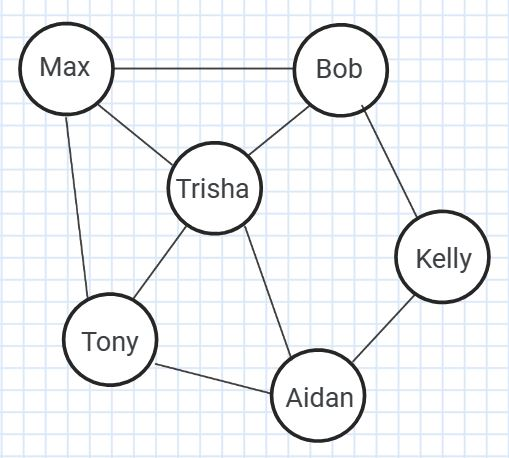
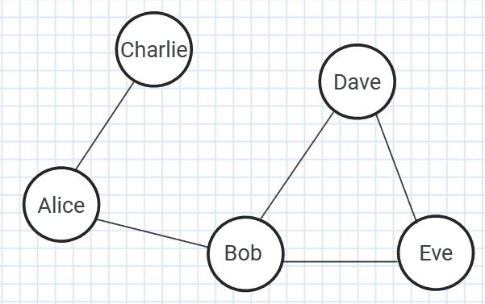

# prog5: I Know A Guy, Who Knows A Guy

**Disclaimer:** I made this as a side project. This is NOT an official assignment, and does not provide any extra credit.

Author: Anthony Umemoto 2023

## Description

Given a network friendships represented as a graph where people are nodes and friendships are edges, how many friends separate one person from another?

For example:

Aidan is 2 steps away from Max. Note that both (Aidan -> Tony -> Max), and (Aidan -> Trisha -> Max) are valid shortest paths. It will often be the case that there are multiple shortest paths. While there are longer paths, such as (Aidan -> Kelly -> Bob -> Max), we are only concerned with finding the shortest path.

**To get started** fork this repository, and clone it onto your local machine. Then, read through this assignment description.

## Your Goal Is...

* Compile a `prog5` executable upon running `make`
* The `prog5` executable should be run using the command:
`./prog5 -d <database file> -i <input file>`
* Read in a database of people, and their connections to others to construct a graph.
* Read in pairs of people from an input file. For each pair, the program should output the shortest path between them to `stdout`.
* The executable should produce no errors in valgrind.
* The executable should produce shortest paths **of the same length** as the example output.

**You may choose to use either C or C++ for this project.**

## Person Class

The `Person` class will act as the nodes in your graph. It should have the following attributes:

* `name`: The person's name.
* `friends`: The list of friends they have, these are the edges in the graph.

You may add more.

It is up to you to decide what methods the `Person` class will have.

## Graph Class

It is up to you to decide what attributes the `Graph` class will have, but it will need the following methods:

* `Graph()`: Constructs a new `Graph`.
* `deleteGraph()`: Free's all associated memory.
* `addPerson(string name)`: Creates a new `Person`, and adds them to the graph.
* `addFriendship(string name1, string name2)`: Connects two people (this is adding an edge to the graph). If one or both names don't exist in the graph, just do nothing.
* `stack<string> findPath(string name1, string name2)`: Uses BFS to find the shortest path between two people. Returns a stack of the names in that shortest path, including name1 and name2.

You may create new methods as you see fit. You may also change the names, arguments, and return types of the methods above.

## prog5.c

This will contain your main function. It should:

1. Parse command line input to get the database and input file names.
2. Construct a `Graph` by reading in lines from the database file. Each line follows this format:

`<new person> <friend 1> <friend 2> ...`

3. Perform each query from the input file, and output the found path. Each query will follow the format:

`<start name> <end name>`

4. Free all memory and exit the program cleanly (a.k.a. no seg fault, no memory leaks, no error codes).

## Tests

3 sample tests are provided in the `tests` directory. Each one has a database, input, and output file. For example, `database1.txt` produces the graph:

> Alice Bob Charlie\
> Bob Alice Dave Eve\
> Charlie Alice\
> Dave Bob Eve\
> Eve Dave Bob

And using the queries from `input1.txt` produces the output given in `output1.txt`:

>finding path between: Alice Eve\
>Alice Bob Eve
>
>finding path between: Charlie Dave\
>Charlie Alice Bob Dave
>
>finding path between: Dave Bob\
>Dave Bob

Your output does not have to match exactly. **If the length of your paths match that of the example output, then your program was successful.**

## Edge Cases

* Two people may not have a path that connects them. If this is the case, output `no connection` instead of the path.
* When connecting two people, one or both of them may not exist as nodes in the graph yet.
* The input file will always have names that exist in the graph.

## Starter Code

If you chose to use C, then you can ignore the starter code provided.

* `prog5.cpp`: contains your main function, as well as a helper `split()` function to make input parsing easier.
* `person.h`: header file declaring the `Person` class. You can edit this.
* `graph.h`: header file declaring the `Graph` class. You can edit this.

## Learning C++

Since this may be your first use of C++, I've created several example programs in the `cpp-examples` directory.